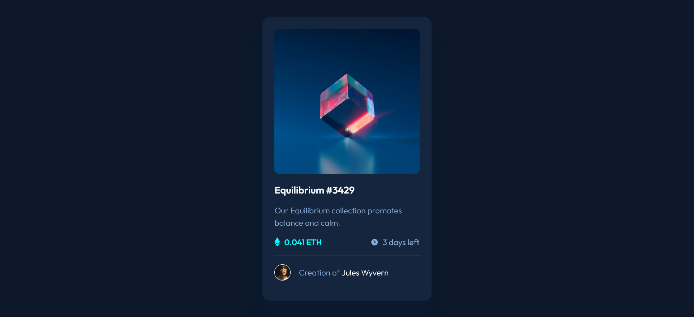

# Frontend Mentor - NFT preview card component solution

This is a solution to the [NFT preview card component challenge on Frontend Mentor](https://www.frontendmentor.io/challenges/nft-preview-card-component-SbdUL_w0U). Frontend Mentor challenges help you improve your coding skills by building realistic projects. 

## Table of contents

- [Overview](#overview)
  - [The challenge](#the-challenge)
  - [Screenshot](#screenshot)
  - [Links](#links)
- [My process](#my-process)
  - [Built with](#built-with)
  - [What I learned](#what-i-learned)
  - [Continued development](#continued-development)
  - [Useful resources](#useful-resources)
- [Author](#author)
- [Acknowledgments](#acknowledgments)

## Overview

### The challenge

Users should be able to:

- View the optimal layout depending on their device's screen size
- See hover states for interactive elements

### Screenshot



### Links

- Solution URL: [Add solution URL here](https://your-solution-url.com)
- Live Site URL: [Add live site URL here](https://your-live-site-url.com)

## My process

### Built with

- Semantic HTML5 markup
- CSS custom properties
- Flexbox
- Mobile-first workflow
- [Google Fonts](https://fonts.google.com/specimen/Outfit) - For styles

### What I learned

To stack an element (in this case adding a div on top of the image) the parent must first be positioned relative and then make the element absolute
```css
.display-img-box{
  position: relative;
}
.hover-effect {
  position: absolute;
}
```

Opacity is the solution for my main struggle which was making the hover effect
```css
.hover-effect{
  opacity:0%
}
.hover-effect:hover {
  opacity: 100%;
}
```

### Continued development

Planning to start using css preprocessor such as SASS for future projects

### Useful resources

- [Stackoverflow](https://stackoverflow.com/questions/69338168/absolute-positioning-to-parent-div) - This helped me find the positioning for the display image hover effect.

## Author

- Website - [Fritz Adelbertus Sitindaon](https://www.furitsu.site)
- Frontend Mentor - [@fritzadelbertus](https://www.frontendmentor.io/profile/fritzadelbertus)

## Acknowledgments

Thank you to FrontEnd Mentor for providing this challenge. Really make me refresh the basic knowledge of HTML and CSS.
